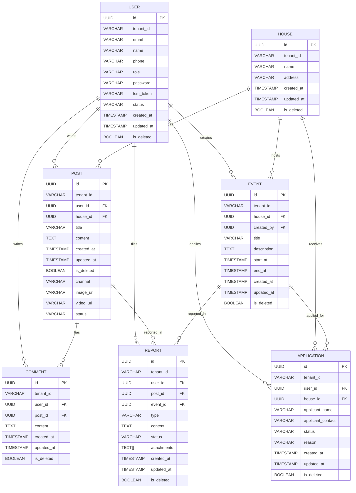

# ERD 및 데이터베이스 문서 (ibookee unified platform)

## 1. ERD (Entity Relationship Diagram)

---

## 2. 테이블별 상세 구조

### User (users)
| 컬럼명         | 타입      | 제약조건/설명                       |
| -------------- | --------- | ----------------------------------- |
| id             | UUID      | PK, 자동생성                        |
| tenant_id      | VARCHAR   | 멀티테넌트 파티셔닝                 |
| email          | VARCHAR   | 암호화, UNIQUE(tenant_id+email)     |
| name           | VARCHAR   | 암호화                              |
| phone          | VARCHAR   | 암호화, nullable                    |
| role           | VARCHAR   | resident/admin/manager/super        |
| password       | VARCHAR   | 해시                                |
| fcm_token      | VARCHAR   | nullable                            |
| status         | VARCHAR   | pending/approved/rejected/expelled  |
| created_at     | TIMESTAMP | 자동생성                            |
| updated_at     | TIMESTAMP | 자동갱신                            |
| is_deleted     | BOOLEAN   | soft delete                         |

- **인덱스**: (tenant_id, email) UNIQUE

### House (houses)
| 컬럼명     | 타입      | 제약조건/설명           |
| ---------- | --------- | ----------------------- |
| id         | UUID      | PK                      |
| tenant_id  | VARCHAR   | 멀티테넌트 파티셔닝     |
| name       | VARCHAR   |                         |
| address    | VARCHAR   | nullable                |
| created_at | TIMESTAMP |                         |
| updated_at | TIMESTAMP |                         |
| is_deleted | BOOLEAN   | soft delete             |

### Post (posts)
| 컬럼명     | 타입      | 제약조건/설명           |
| ---------- | --------- | ----------------------- |
| id         | UUID      | PK                      |
| tenant_id  | VARCHAR   | 멀티테넌트 파티셔닝     |
| user_id    | UUID      | FK(users)               |
| house_id   | UUID      | FK(houses)              |
| title      | VARCHAR   |                         |
| content    | TEXT      |                         |
| created_at | TIMESTAMP |                         |
| updated_at | TIMESTAMP |                         |
| is_deleted | BOOLEAN   | soft delete             |
| channel    | VARCHAR   | 이벤트/공지/소모임 등   |
| image_url  | VARCHAR   | nullable                |
| video_url  | VARCHAR   | nullable                |
| status     | VARCHAR   | pending/approved 등     |

### Comment (comments)
| 컬럼명     | 타입      | 제약조건/설명           |
| ---------- | --------- | ----------------------- |
| id         | UUID      | PK                      |
| tenant_id  | VARCHAR   | 멀티테넌트 파티셔닝     |
| user_id    | UUID      | FK(users)               |
| post_id    | UUID      | FK(posts)               |
| content    | TEXT      |                         |
| created_at | TIMESTAMP |                         |
| updated_at | TIMESTAMP |                         |
| is_deleted | BOOLEAN   | soft delete             |

### Event (events)
| 컬럼명     | 타입      | 제약조건/설명           |
| ---------- | --------- | ----------------------- |
| id         | UUID      | PK                      |
| tenant_id  | VARCHAR   | 멀티테넌트 파티셔닝     |
| house_id   | UUID      | FK(houses)              |
| created_by | UUID      | FK(users)               |
| title      | VARCHAR   |                         |
| description| TEXT      |                         |
| start_at   | TIMESTAMP |                         |
| end_at     | TIMESTAMP |                         |
| created_at | TIMESTAMP |                         |
| updated_at | TIMESTAMP |                         |
| is_deleted | BOOLEAN   | soft delete             |

- **참여자**: event_participants (N:M, user_id, event_id)

### Application (applications)
| 컬럼명           | 타입      | 제약조건/설명           |
| ---------------- | --------- | ----------------------- |
| id               | UUID      | PK                      |
| tenant_id        | VARCHAR   | 멀티테넌트 파티셔닝     |
| user_id          | UUID      | FK(users)               |
| house_id         | UUID      | FK(houses)              |
| applicant_name   | VARCHAR   | 암호화                  |
| applicant_contact| VARCHAR   | 암호화                  |
| status           | VARCHAR   | pending/approved 등     |
| reason           | VARCHAR   | nullable                |
| created_at       | TIMESTAMP |                         |
| updated_at       | TIMESTAMP |                         |
| is_deleted       | BOOLEAN   | soft delete             |
- **인덱스**: (tenant_id, user, house, status, created_at)

### Report (reports)
| 컬럼명      | 타입      | 제약조건/설명           |
| ----------- | --------- | ----------------------- |
| id          | UUID      | PK                      |
| tenant_id   | VARCHAR   | 멀티테넌트 파티셔닝     |
| user_id     | UUID      | FK(users)               |
| post_id     | UUID      | FK(posts), nullable     |
| event_id    | UUID      | FK(events), nullable    |
| type        | VARCHAR   | abuse/spam 등           |
| content     | TEXT      |                         |
| status      | VARCHAR   | submitted 등            |
| attachments | TEXT[]    | nullable                |
| created_at  | TIMESTAMP |                         |
| updated_at  | TIMESTAMP |                         |
| is_deleted  | BOOLEAN   | soft delete             |

---

## 3. 인덱스/파티셔닝/최적화 전략
- 모든 테이블: tenant_id 파티셔닝(멀티테넌트)
- 주요 FK/조인 컬럼 인덱스화
- Application: (tenant_id, user, house, status, created_at) 복합 인덱스
- User: (tenant_id, email) UNIQUE 인덱스
- Soft delete: is_deleted 컬럼 활용, 쿼리시 항상 필터
- 대용량 테이블(Feed, Report 등): created_at, status 인덱스 추가

---

## 4. 운영/개발 가이드
- 모든 쿼리/조인에 tenant_id, is_deleted 조건 필수
- FK/PK/유니크/체크 제약조건은 TypeORM + DB 레벨 모두 적용
- 파티셔닝/인덱스 설계는 트래픽/데이터량에 따라 주기적 점검
- 민감정보(이메일, 연락처 등)는 암호화 저장, 접근 최소화
- 마이그레이션/스키마 변경은 GitOps로 관리

---

> 본 문서는 ibookee unified platform의 데이터베이스 구조 및 운영 기준의 최신 상태를 반영합니다. 개발/운영팀은 이 문서를 참고하여 데이터 모델링, 쿼리, 마이그레이션, 보안 정책을 준수해야 합니다. 